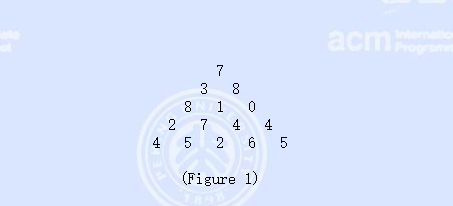
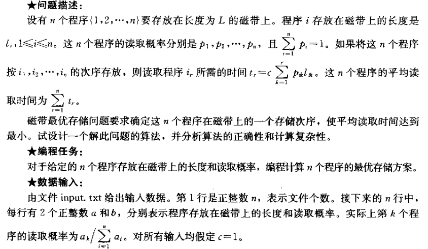
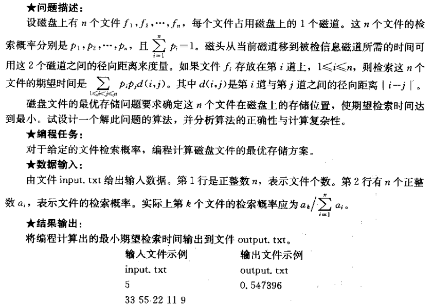

# 算法分析与设计

基本上就是复杂度分析、几种排序、动态规划、图的最短路径。作业做好考试应该不难。

## 实验一：递归与分治

* 理解递归算法的思想和递归程序的执行过程，并能熟练编写递归程序
* 掌握分治算法的思想，对给定的问题能设计出分治算法予以解决

### [题目一](./EXP1.1.c)

根号n段合并排序算法：将数组a[0,n-1]划分为floor(根号n)个子数组，每个子数组有O(根号n)个元素。然后递归地对分割后的子数组进行排序，最后将所得到的floor(根号n)个排好序的子数组合并排序。

### [题目二](./EXP1.2.c)

用分治法设计一个算法，在数组A中寻找最大元素和最小元素。

## 实验二：动态规划

理解动态规划的基本思想，理解动态规划算法的两个基本要素最优子结构性质和子问题的重叠性质。熟练掌握典型的动态规划问题。掌握动态规划思想分析问题的一般方法，对较简单的问题能正确分析，设计出动态规划算法，并能快速编程实现。

### [题目一 扩展距离](./EXP2.1.c)

对于长度相同的2个字符串A和B，其距离定义为相应位置字符距离之和。2个非空格字符的距离是它们的ASCII码之差的绝对值。空格与空格的距离为0，空格与其他字符的距离为一定值k。

在一般情况下，字符串A和B的长度不一定相同。字符串A的扩展是在A中插入若干空格字符所产生的字符串。在字符串A和B的所有长度相同的扩展中，有一对距离最小的扩展，该距离称为字符串A和B的扩展距离。

算法要求如下

  1. 数据输入：第1行是字符串A，第2行是字符串B，第3行是空格与其他字符的距离定值k。
  2. 输出：字符串A和B的扩展距离。

例如输入：

```input
cmc
snmn
2
```

输出：10

注：设字符串A和B的子串A[1..i]和B[1..j]的扩展距离为val(i,j)，则val(i,j)具有最优子结构性质，递归定义为：val(i,j)=min{val(i-1,j)+k, val(i,j-1)+k, val(i-1,j-1)+dist(ai,bj)}

### [题目二 三角形最大数字路径](./EXP2.2.c)



在上面的数字三角形中寻找一条从顶部到底边的路径，使得路径上所经过的数字之和最大。路径上的每一步都只能往左下或右下走。只需要求出这个最大和即可，不必给出具体路径。

三角形的行数大于1小于等于100，数字为0~99

输入格式：

```input
5 //表示三角形的行数 接下来输入三角形
7
3  8
8  1  0
2  7  4  4
4  5  2  6  5
```

要求输出最大和

## [实验三：贪心算法](./EXP3.cs)

给定k个排好序的序列s1,s2,...,sk，用2路合并算法将这k个序列合并成一个序列。假设所采用的2路合并算法合并2个长度为m和n的序列需要m+n-1次比较。设计一个算法确定2路合并次序，使所需的总比较次数最少。

## [实验四：顺序统计算法设计](./EXP4.cs)

给定数组A[0..n-1]，试设计一个算法，在最坏情况下用n+logn次比较找出A[0..n-1]中元素的最大值和次大值。

PS. 其实这个题目没有使用顺序统计算法...

## [实验五：最短路径算法](./EXP5.c)

实现单源最短路经的迪杰斯特拉算法（Dijkstra），要求：分别采用数组、最小堆实现优先级队列。

一组结点集合S，从源结点s到该集合中每个结点之间的最短路径已经被找到，算法重复从结点集V-S中选择最短路径估计最小的结点u，将u加入到集合S，然后对所有从u发出的边进行松弛。

## [磁带最优存储问题](./磁带最优存储问题.c)



## [磁盘文件最优存储问题](./磁盘文件最优存储问题.cs)



## [矩阵链乘](./矩阵链乘.txt)

算死了。考试要考，手写。
